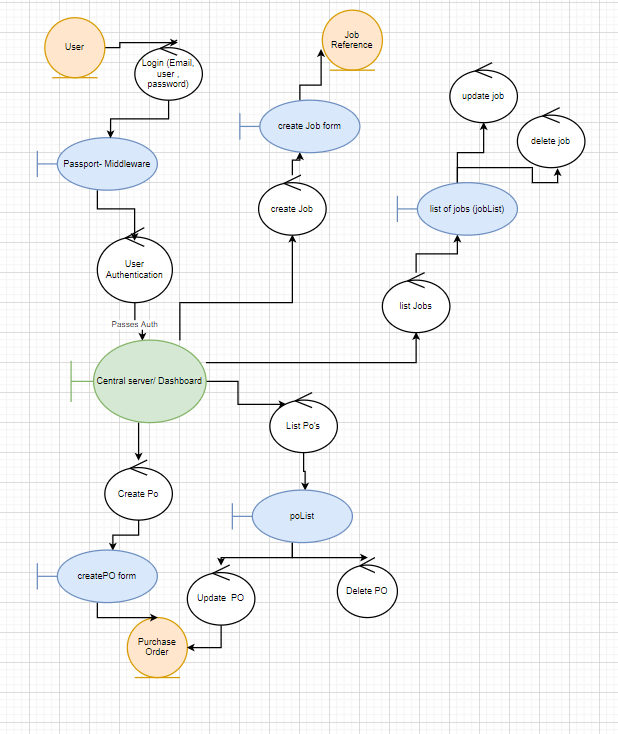
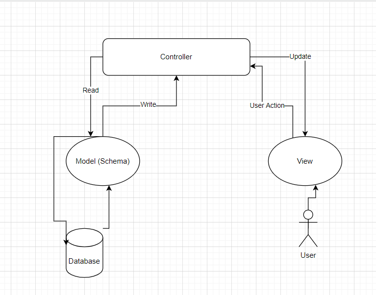
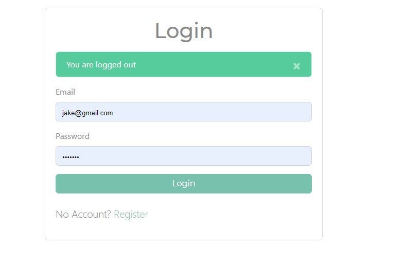
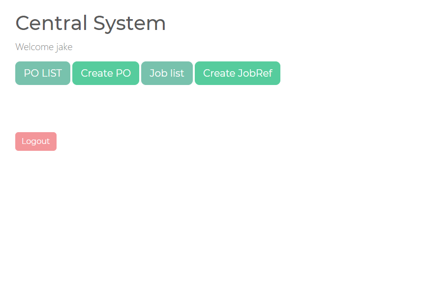
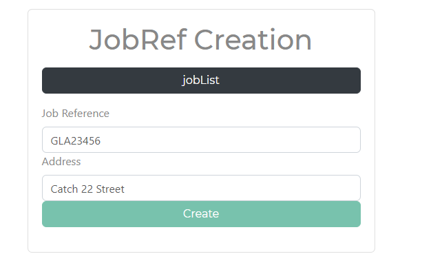
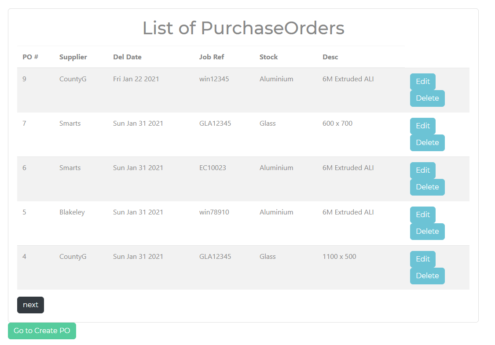

# [Purchasing519](https://github.com/4ashtj48/COM519-assignment-final)


---

Hosted on Heroku
https://gentle-atoll-40417.herokuapp.com/

Link to git repo 
https://github.com/4ashtj48/COM519-assignment-final

## Setup

### Install Dependencies

``` cmd
-$ npm install
```
### running locally
```
-$ npm run dev
```

## Introduction

I used to work as part of a purchasing team, and decided to base this project around the system I used to work with, which, for the most part, was very clunky, prone to user errors and needed many irrelevant fields to be filled in for it to process commands. This was mainly due to the company using software geared towards purchase ledger work such as invoicing and payroll management for procurement and sales functions.

I wanted to recreate and try to streamline a few of the areas for creating a purchase order along with the surrounding system to see if it could be streamlined, along with using a non-relational database for some of the otherwise relational functions to present to the company a less rigid solution for creating and storing information.

---

## System Overview

The proof-of-concept I will be developing will have three collections, users, purchase orders and job references. The primary function of this system will be to carry out the CRUD functions (create, read, update and delete) for both collections accessed by the user (jobrefs and po’s).
The below robustness diagram shows a high-level overview of how the system should function.



In terms of views, the user will be looking at five separate pages, a central controller to view all user functions, which are  createJob and createPO for the ‘create’ functions, ‘jobList’ and ‘poList’ for looking at a list of all jobs and purchase orders respectively. The idea was to have a delete and update/modify function alongside each of the results which redirects to the ‘create’ page again with all the information filled in as previous.

All of the data will in turn be stored in collections using mongoDB Atlas, which is using a cluster to store all current data including the user logins.

---

## Key design decisions

Firstly, I wanted to adopt the MVC(model, view, controller) stack which separates the application into logical components when configuring the application.



As a relatively common and up-to-date method of designing applications which I wanted to expand upon and adapt to my own programme. Simply, the users are only interacting with the ‘views’ whilst the controllers are containing the functions which are being used accessed, and finally the model, which is essentially the schema, breaking down the collection of data.

A lot of decisions I made for this project were aimed to help me expand my own knowledge   implementing useful elements of full-stack development, aimed at giving me experience for future work as well as learning the intricacies of the framework such as node and express.
Continuing this, although I was originally considering using an SQL database as my data does have some relational data, I decided to implement a non-relational database using MongoDB atlas for the clusters and passing in the JSON output which is used in the schemas.

---

## Database Design

To log-in, allowing a user to authenticate and gain access to the rest of the database and functions, I wanted to demonstrate a layer of protection using ‘passport’ which is a middleware linking to the Atlas cluster, providing encryption (Bcrypt) for the passwords. 

  *	In this proof-of-concept, I have not removed the ability to register, so right now anyone can access this resource by making an account. In a full implementation, it would only allow a user to log-in if a password/user, email etc matched up with the user collection.



I have then provided a very simple central system- UI for navigation, allowing for people to access all relevant buttons which is only accessible by created users.



In order of creation, you would need a job reference to exist to be able to create a Purchase order. I have reduced the fields down for this model, only taking in ‘job ref’ and ‘address’ in the schema as I wanted to test the ‘relational’ aspect of the collections.



By simply asking in the model for the jobRef to be unique, acting similar to a primary key, no other job refs can be duplicated if one exists with the same jobRef. The end goal of this is to allow the job reference field when creating purchase orders to be accessible and allow to select from a list, combating a previous issue where users would frequently mistype or add prefixes in this input field.


There will be many PO’s which can use the same jobRef, and in this case PO number is the unique identifier. I have tried to make it so as many fields as possible drop-down options so that there is very little user discrepancy.
  *	To go further than this and allow for a larger collection of data, I would include a wild-card ‘*’ search function within each of these drop downs, including the jobRef field and I can identify this as being a current issue, users would have to scroll down for a long while if there were any more than 20 options

---



I have both a list of purchase orders and list of job references that can be accessed by the central controller. 
Both edit functions use a poDetail/ jobDetail view respectively which essentially sends them back to the create pages, however has the record-fields filled out how they were in the list in the create view.

The delete functions, both use the _id which is a mongoose variable it assigns as its own unique identifier it stores in the JSON format along with our schema to delete the record from the list.
I found, when using DELETE and PUT methods with tables in HTML, a method-override function was required to have these working correctly with the routes.

  *	When deleting jobs, do not delete one that is attached to a Purchase order number, otherwise this will break the PO list and will need all related purchase orders to be deleted before the list works again.
  *	For future considerations, I would also not want all users to be able to delete job refs and purchase orders, possibly only assigning this function to the manager.

---

## Security & Scalability

I believe the security is reasonable, except for currently allowing users to register and sign in with that which I will keep in for testing and demo purposes. One of the functions of passport is ‘ensure Authentication’ which checks, whenever one of the routes is being accessed if the user is logged in.
This means, even if the user wants to attempt xml/ hyperlink injection to skip authentication and access the dashboard and CRUD functions.
  *	As mentioned earlier, I would limit certain functions only for specific users using their unique _id that mongoDB stores in atlas.

In terms of scalability, non-relational databases tend to scale horizontally, as long as there are more servers and clusters available, this model could be transferable to a multitude of users. However, as I have mainly designed this with a small team of users in mind, I would not expect a massive increase in traffic.
I do prefer how mongoDB allows for queries to be pulled from the system and, again would very easily be able to implement more views for other parts of the system, including a option to check against costs against a particular job, for example.


---

## Conclusion

Overall, I am glad I managed to get the CRUD functions and authentication working correctly and am happy with the outcome which is fit for a proof-of-concept for the purchasing system I once worked with.

Using the MVC stack was rather enlightening, it took a few steps to see through the organisation and start to see how it connects, allowing the user to only see the ‘view’ page which is separate from the model and can only access it through the controller. 
In terms of a learning experience, this has been incredibly helpful. As aspiring to be a full-stack developer, using various tools and going beyond scope to use middleware such as passport and multer, pagination, using the MVC stack and interacting with more parts of bootstrap has been priceless.

I will still likely be doing more work on this after the deadline as it has been a very useful module and has helped realise some of the trickier aspects of data handling and how to deal with them. An example is when showing the jobRef on the poList, having to use JSON.stringify and Json viewers to see how it was being handled before coming to a solution.

Although I am happy with the outcome, there are still many aspects I would have liked to improve, such as originally planning on adding another collection ‘Stock’ with its own pricing and ID which would add another layer, however I believe I was a bit too optimistic with my original design to simulate other parts of the system.

There are also a few issues with the finished design, as pointed out earlier, when a jobRef is deleted which is being used by a purchase order, the list, and the programme will break in its entirety. I would like to have implemented the ability to throw an error when trying to delete or change a jobRef when it is being used by a purchase order.

---

